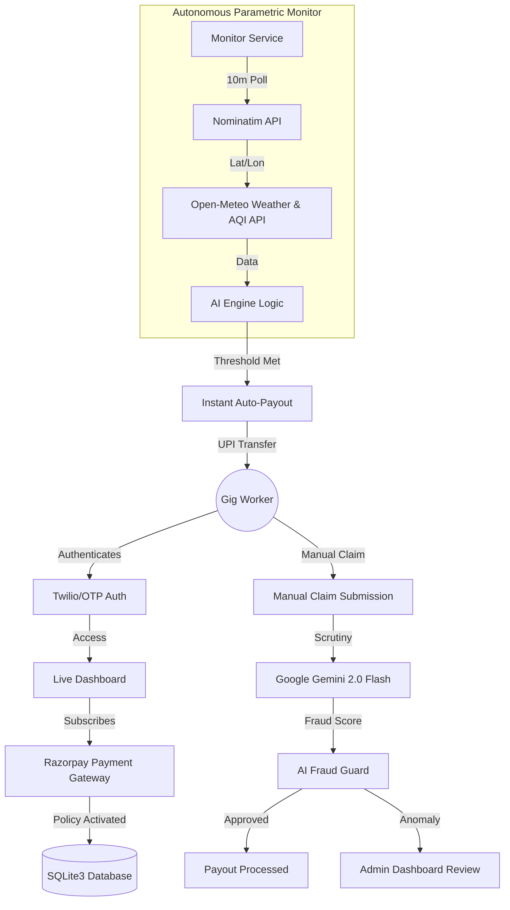

# 🛡️ Trinetra: AI-Powered Parametric Income Insurance

**Trinetra** is a mission-critical platform designed to provide financial stability to gig delivery partners (Zomato, Swiggy, Blinkit, Amazon) in India. By leveraging real-time environmental data and Generative AI, Trinetra automates insurance payouts for income loss caused by extreme weather, platform outages, or local curfews.

---

## 📊 System Flowchart

The following diagram illustrates how the Trinetra ecosystem handles everything from user authentication to autonomous parametric payouts.



---

## 🌟 Actual & Real Features

### 1. **Autonomous Parametric Triggers**
Unlike traditional insurance that requires weeks of paperwork, Trinetra uses **Parametric triggers**.
- **Extreme Weather**: Automated payouts for Heavy Rain (>12mm), Extreme Heat (>44°C), or Severe Wind (>50km/h).
- **AQI Protection**: Instant triggers when Air Quality Index exceeds 250 (Hazardous levels).
- **Platform Outage**: Coverage for technical downtimes of major delivery platforms.

### 2. **Dynamic Risk Map & Live Geolocation**
- Uses **Open-Meteo** and **Nominatim** to detect the worker's precise zone.
- A **Glassmorphism-styled map** displays Red/Orange/Green risk levels across 300+ Indian cities in real-time.

### 3. **AI Fraud Guard (Powered by Gemini 2.0 Flash)**
- Manual claims are cross-referenced with location history and motion sensor data.
- **Google Gemini AI** analyzes the claim's context to detect anomalies, assigning a "Fraud Score" and auto-approving or flagging the claim.

### 4. **Betterment AI (Predictive Insights)**
- A **Python-based Random Forest model** analyzes historical weather and worker data.
- Provides proactive earnings insights, suggesting safer zones or optimal working hours to maximize income while minimizing risk.

### 5. **Earnings Risk Simulator**
- An interactive tool where workers input their daily earnings and city.
- Predicts annual financial risk based on that city's historical weather patterns and shows how Trinetra plans mitigate that risk.

### 6. **PWA (Progressive Web App) Excellence**
- **Offline First**: Works in low-connectivity areas using custom Service Workers.
- **Installable**: Can be added to Android/iOS home screens for a native app experience.

---

## 🛠️ Technology Stack

| Layer | Technologies Used |
| :--- | :--- |
| **Frontend** | Vanilla JS (ES6+), HTML5, CSS3 (Glassmorphism), Service Workers |
| **Backend** | Node.js, Express.js, `node-fetch`, `compression`, `helmet` |
| **Database** | SQLite3 (Persistent with Railway Volumes) |
| **Artificial Intelligence** | Google Gemini 2.0 Flash API (NLP & Fraud Detection) |
| **Machine Learning** | Python, Scikit-learn (Random Forest), Pandas, NumPy |
| **Integrations** | Razorpay (Payments), Twilio (SMS Auth), Open-Meteo (Weather API) |
| **Geoservices** | Nominatim (OpenStreetMap Reverse Geocoding) |

---

## 📁 Project Structure

```text
├── backend/
│   ├── engine/          # AI Engine & Risk Calculation Logic
│   ├── services/        # Autonomous Monitor & Notification Services
│   ├── server.js        # Express API Endpoints & Proxy
│   └── database.js      # SQLite Schema & Seeding Logic
├── frontend/
│   ├── app.js           # Core PWA Logic & UI Interactions
│   ├── sw.js            # Service Worker for Offline Support
│   └── index.html       # Single Page Application UI
├── ml/
│   ├── train.py         # Random Forest Model Training
│   ├── generate_data.py # Synthetic Data Generation for ML
│   └── requirements.txt # Python Dependencies
└── README.md            # You are here
```

---

## 🚀 Getting Started

### Prerequisites
- Node.js (v18+)
- Python (v3.9+)
- Google Gemini API Key

### Local Installation

1. **Clone & Install Backend**:
   ```bash
   cd backend
   npm install
   ```

2. **Setup ML Core**:
   ```bash
   cd ml
   pip install -r requirements.txt
   python main.py  # Trains the initial Betterment Model
   ```

3. **Environment Configuration**:
   Create a `.env` file in the `backend/` directory:
   ```env
   GEMINI_API_KEY=your_key_here
   RAZORPAY_KEY_ID=your_key_here
   RAZORPAY_KEY_SECRET=your_key_here
   PORT=3000
   ```

4. **Run the Platform**:
   ```bash
   npm run dev
   ```

---

## 🛡️ Security & Persistence
- **Helmet.js**: Implemented for production-grade security headers.
- **SQLite Persistence**: On Railway, the database is mounted to a persistent volume at `/app/database.sqlite` to ensure user data survives deployments.
- **Cache Control**: Custom headers prevent "zombie" versions of the PWA from persisting in the browser.

---

## 📄 License
This project is licensed under the ISC License. 

Designed with ❤️ for the gig workers of India.
